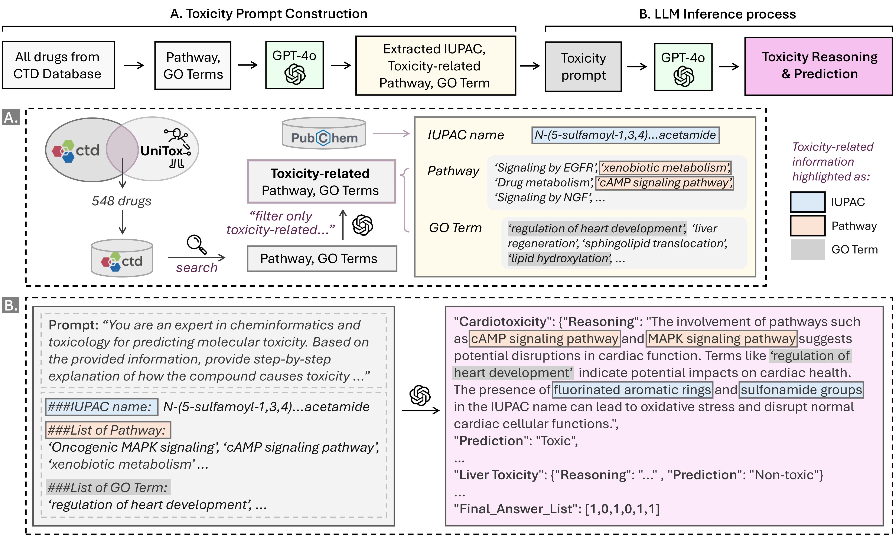

# CoTox: Chain-of-Thought-Based Molecular Toxicity Reasoning and Prediction

[](https://arxiv.org/abs/2508.03159)
[](https://ieeexplore.ieee.org/document/11356816)



## Introduction
Can LLM assess molecular toxicity? 💊💀
During drug development, it is crucial to identify whether the chemical compound is toxic or not.
We introduce CoTox, a novel framework that utilizes LLMs for Molecular Toxicity Prediction.
Unlike traditional models that rely solely on molecular structure, CoTox integrates chemical structures, biological pathways, and GO terms to predict six types of organ-specific toxicities, including cardiotoxicity, hepatotoxicity, and nephrotoxicity.
By using Chain-of-Thought prompting, CoTox generates step-by-step reasoning for each prediction, offering transparent and interpretable explanations for why a compound might be toxic.
Interestingly, we also found that IUPAC names work better than SMILES when interfacing with LLMs, thanks to their human-readable format.
Our findings position CoTox as an interpretable and practical tool for early-stage drug development.

## How to Run

### Environment Setup
Create the conda environment using the provided configuration file.

```bash
conda env create -f environment.yml
conda activate cotox
```

### Run CoTox
After activating the environment, execute the following script:
```bash
run_cotox.sh
```

## Citation
Please cite related papers/blogs using this BibTeX if you find this useful for your research and applications.
```bibtex
@inproceedings{park2025cotox,
  title={CoTox: Chain-of-Thought-Based Molecular Toxicity Reasoning and Prediction},
  author={Park, Jueon and Park, Yein and Song, Minju and Park, Soyon and Lee, Donghyeon and Baek, Seungheun and Kang, Jaewoo},
  booktitle={2025 IEEE International Conference on Bioinformatics and Biomedicine (BIBM)},
  pages={4002--4007},
  year={2025},
  organization={IEEE}
}
```
